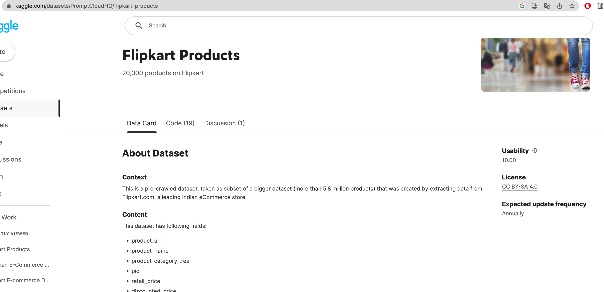

# Classifiez automatiquement des biens de consommation 
Attention! Lire ce fichier avant de continuer sur les autres car il contient des éléments pris en compte lors de l'évaluation des critères à respecter

## Introduction

### Contexte
Place de marché® est un e-commerce qui met directement en relation les vendeurs et les acheteurs. A ce jour, les vendeurs doivent insérer une photo, une description du produit qu'ils vendent et ensuite lui donner une catégorie pré-déterminée par la société. Cependant, il arrive que les vendeurs se trompent lorsqu'ils choississent la catégorie à laquelle appartient leur produit.

### Problématique
C'est pourquoi Place de marché® souhaite automatiser la catégorisation des produits à partir de l'image et/ou de la description liées au produit à l'aide d'un moteur de classifiation automatique.[<sup>1</sup>](https://openclassrooms.com/fr/paths/164/projects/631/assignment)


### Déroulé du sujet
Le sujet sera sectionné en quatre sous-partie:
1. Exploration et Analyse de la donnée textuelle et visuelle 
2. Création de modèles non supervisés se basant sur du texte puis sur des images
3. Création de modèles supervisés se basant sur le meilleur modèle non-supervisé
4. Création d'une API 

### Ordre des supports
Voici l'ordre de lecture des supports:
0. le fichier README.md dans lequel vous allez retrouver le condensé de l'énoncé, le plan à suivre pour comprendre le projet et bien le manipuler 
1. le dossier Terrien_Audrey_1_pretraitement_feature_extraction_faisaibilite_092023
   1. le fichier Terrien_Audrey_1_exploration_textuelle.ipynb
   2. le fichier Terrien_Audrey_1_exploration_visuelle.ipynb
   3. le fichier Terrien_Audrey_3_classification_non_supervisée_textuelle.ipynb
   4. le fichier Terrien_Audrey_3_classification_non_supervisée_ancienne_visuelle.ipynb
2. le dossier my_packages qui contient plusieurs fonctions dans ses sous-fichiers python
3. le fichier Terrien_Audrey_2_notebook_classification_092023.ipynb
4. le fichier Terrien_Audrey_3_notebook_traitement_avec_technique_recente_092023.ipynb
5. le fichier Terrien_Audrey_4_script_Python_092023.ipynb

Ensuite pour compléter, il existe d'autres fichiers/documents qui n'ont pas un ordre de lecture particulier mais qui viennent compléter le travail et sa compréhension.
Ces derniers sont:
- Le dossier img_notebooks qui contient les images qui ont été insérées soit dans les notebooks, soit dans le fichier README.md.
- Le dossier input qui contient la donnée originale (flipkart_com-ecommerce_sample_1050.csv ou Images) mais aussi les sous-dossiers d'images redimensionnées/retravaillées pour remplacer les images qui passent dans les modèles de classification.
- Le dossier oc_help qui contient les différents fichiers présentés dans l'énoncé de base et qui ont été donnés par OC pour avancer plus vite sur le projet
- Le dossier output qui contient des fichiers de sortie comme les modèles ou les résultats des modèles
- les fichiers Definitions.md et LICENCE
- les fichiers requirements.txt, .gitignore, .gitattributes

### Les étapes à faire
Dans une première partie, il faut faire des modèles non-supervisés passant par les étapes suivantes: 
- Un prétraitement des données texte ou image suivant le cas ;
- Une extraction de features ;
- Une réduction en 2 dimensions, afin de projeter les produits sur un graphique 2D, sous la forme de points dont la couleur correspondra à la catégorie réelle ;
- Analyse du graphique afin d’en déduire ou pas, à l’aide des descriptions ou des images, la faisabilité de regrouper automatiquement des produits de même catégorie ;
- Réalisation d’une mesure pour confirmer ton analyse visuelle, en calculant la similarité entre les catégories réelles et les catégories issues d’une segmentation en clusters.

### Les contraintes à prendre en compte
Dans la première partie où des modèles non-supervisés ont été testés, voici les approches d'extraction texte à utiliser : 
- de type “bag-of-words”, comptage simple de mots et Tf-idf ;
- de type word/sentence embedding classique avec Word2Vec, puis BERT et enfin USE (Universal Sentence Encoder) 

Dans cette même partie, voici les algorithmes d'extraction image à utiliser:
- de type SIFT/ORB/SURF
- de type CNN transfer Learning

Dans la deuxième partie du sujet où au moins un modèle supervisé est testé, il faut utiliser la data augmentation pour optimiser le modèle. 

Dans la dernière partie du sujet, il faut utiliser une API pour ramener les données des 10 premiers produits à base de “champagne” dans un fichier CSV provenant de ce [database](https://rapidapi.com/edamam/api/edamam-food-and-grocery-database) où les champs suivants ont été récupérés: foodId, label, category, foodContentsLabel et enfin image.

### Matériels supplémentaires fournis par OpenClassrooms
Des documents ont été fournis par OpenClassrooms pour gagner du temps dans le traitement du sujet en question. Ils peuvent être retrouvés dans le dossier oc_help. 

### Matériels et librairies pour recréer ce projet
Vscode, Python (version 3.9.17), 
librairies: dans le fichier requirements.txt

## Référentiel d'évaluation
#### Prétraiter des données textes pour obtenir un jeu de données exploitable
- [x] Nettoyage des champs de texte (suppression de la ponctuation et des mots de liaison, mise en minuscules) [<sup>1</sup>](dossier/fichier.ipynb)
- [x] Ecriture d'une fonction permettant de “tokeniser” une phrase[<sup>2</sup>](dossier/fichier.ipynb)
- [x] Ecriture d'une fonction permettant de “stemmer” une phrase[<sup>3</sup>](dossier/fichier.ipynb)
- [x] Ecriture d'une fonction permettant de “lemmatiser” une phrase[<sup>4</sup>](dossier/fichier.ipynb)
- [ ] Feature engineering de type bag-of-words (bag-of-words standard : comptage de mots, et Tf-idf), avec des étapes de nettoyage supplémentaires : seuil de fréquence des mots, normalisation des mots[<sup>5</sup>](dossier/fichier.ipynb)[<sup>6</sup>](dossier/fichier.ipynb)
- [ ] Illustration des 5 étapes précédentes sur une phrase test[<sup>7</sup>](dossier/fichier.ipynb)
- [ ] Mis en oeuvre 3 démarches de word/sentence embedding : Word2Vec, BERT et USE[<sup>8</sup>](dossier/fichier.ipynb)[<sup>9</sup>](dossier/fichier.ipynb)[<sup>10</sup>](dossier/fichier.ipynb)
- [x] Vérification du respect de la propriété intellectuelle[<sup>11</sup>](#intel-prop)

#### Prétraiter des données images pour obtenir un jeu de données exploitable
- [ ] Utilisation de librairies spécialisées pour un premier traitement du contraste (ex. : openCV)[<sup>12</sup>](dossier/fichier.ipynb)
- [ ] Traitement d'images (par exemple passage en gris, filtrage du bruit, égalisation, floutage) sur un ou plusieurs exemples[<sup>13</sup>](dossier/fichier.ipynb)[<sup>14</sup>](dossier/fichier.ipynb)[<sup>14</sup>](dossier/fichier.ipynb)[<sup>14</sup>](dossier/fichier.ipynb)
- [ ] Feature engineering de type "bag-of-images" via la génération de descripteurs (algorithmes ORB, ou SIFT, ou SURF)[<sup>14</sup>](dossier/fichier.ipynb)[<sup>14</sup>](dossier/fichier.ipynb)
- [ ] Feature engineering via un algorithme de Transfer Learning basé sur des réseaux de neurones, comme par exemple CNN[<sup>15</sup>](dossier/fichier.ipynb)
- [ ] Vérification du respect de la propriété intellectuelle[<sup>11</sup>](#intel-prop) 

#### Mettre en œuvre des techniques de réduction de dimension
- [ ] Justification de la réduction de dimension[<sup>15</sup>](dossier/fichier.ipynb)[<sup>15</sup>](dossier/fichier.ipynb)
- [ ] Réduction de dimension adaptée à la problématique (ex. : ACP)[<sup>15</sup>](dossier/fichier.ipynb)[<sup>15</sup>](dossier/fichier.ipynb)
- [ ] Justification le choix des valeurs des paramètres dans la méthode de réduction de dimension retenue (ex. : le nombre de dimensions conservées pour l'ACP)[<sup>15</sup>](dossier/fichier.ipynb)[<sup>15</sup>](dossier/fichier.ipynb)

#### Représentation graphique des données à grandes dimensions
- [ ] Technique de réduction de dimension (via LDA, ACP, T-SNE, UMAP ou autre technique)[<sup>15</sup>](dossier/fichier.ipynb)[<sup>15</sup>](dossier/fichier.ipynb)[<sup>15</sup>](dossier/fichier.ipynb)[<sup>15</sup>](dossier/fichier.ipynb)
- [ ] Visualisation graphique des données réduites en 2D (par exemple affichage des 2 composantes du T-SNE)[<sup>15</sup>](dossier/fichier.ipynb)[<sup>15</sup>](dossier/fichier.ipynb)[<sup>15</sup>](dossier/fichier.ipynb)[<sup>15</sup>](dossier/fichier.ipynb)
- [ ] Analyse graphique en 2D[<sup>15</sup>](dossier/fichier.ipynb)[<sup>15</sup>](dossier/fichier.ipynb)[<sup>15</sup>](dossier/fichier.ipynb)[<sup>15</sup>](dossier/fichier.ipynb)

#### Définir la stratégie de collecte de données en recensant les API disponibles, et réaliser la collecte des données répondant à des critères définis via une API (interface de programmation) en prenant en compte les normes RGPD, afin de les exploiter pour l’élaboration d’un modèle.[<sup>30</sup>](Terrien_Audrey_4_script_Python_052024.ipynb)
- [ ] Exposition de la stratégie de collecte de données et recencement des API disponibles pour la mise en oeuvre du projet
- [ ] Création et test d'une requête pour obtenir les données via l’API
- [ ] Récupération des seuls champs strictement nécessaires. Ici, il s'agit des champs: foodId, label, category, foodContentsLabel et image. 
- [ ] Filtrage de la data pour ne récupérer que les lignes correspondant à l’ingrédient (“ingr”) champagne
- [ ] Stockage des données collectées via l’API dans un fichier utilisable (ex. : fichier CSV ou pickle).
- [ ] Vérification du respect des normes RGPD dans la collecte et du stockage des données
  - [ ] Présentation des 5 grands principes du RGPD 
  - [ ] Vérification de l'utilisation uniquement des données nécessaire pour traiter le sujet

#### Définir la stratégie d’élaboration d’un modèle d'apprentissage profond, concevoir ou ré-utiliser des modèles pré-entraînés (transfer learning) et entraîner des modèles afin de réaliser une analyse prédictive.
- [ ] Exposition de la stratégie d’élaboration d’un modèle pour répondre à un besoin métier (par exemple : choix de conception d’un modèle ré-utilisation de modèles pré-entraînés).
- [ ] Identification de la ou les cibles. 
- [ ] Séparation du jeu de données en jeu d’entraînement, jeu de validation et jeu de test. 
- [ ] Vérification qu'il n'y a pas de fuite d’information entre les deux jeux de données (entraînement, validation et test). 
- [ ] Entrainement sur plusieurs modèles d’apprentissage profond (par exemple à l’aide de la librairie Tensorflow / Keras) en partant du plus simple vers les plus complexes. 
- [ ] Utilisation de modèles à partir de modèles pré-entraînés (technique de Transfer Learning)

#### Évaluer la performance des modèles d’apprentissage profond selon différents critères (scores, temps d'entraînement, etc.) afin de choisir le modèle le plus performant pour la problématique métier.
- [ ] Choix d'une métrique adaptée à la problématique métier, et sert à évaluer la performance des modèles 
- [ ] Justification de la métrique d’évaluation 
- [ ] Evaluation de la performance d’un modèle de référence et comparaison pour évaluer la performance des modèles plus complexes 
- [ ] Calcul, hormis la métrique choisie, d'au moins un autre indicateur pour comparer les modèles (par exemple : le temps nécessaire pour l’entraînement du modèle) 
- [ ] Optimisation d'au moins un des hyperparamètres du modèle choisi (par exemple : le choix de la fonction Loss, le Batch Size, le nombre d'Epochs) 
- [ ] Synthèse comparative des différents modèles, par exemple sous forme de tableau. 

### Utiliser des techniques d’augmentation des données afin d'améliorer la performance des modèles.
- [ ] Techniques d’augmentation des données (ex. pour des images : rotation, changement d’échelle, ajout de bruit…). 
- [ ] Synthèse comparative des améliorations de performance grâce aux différentes techniques d'augmentation de données utilisées (maîtrise de l’overfitting, meilleur score).

### La soutenance
Pour la soutenance orale, voici le déroulé à suivre:
Durée: 30 minutes dont 10 mn de discussion et de débriefing. 

Présentation (20 minutes) 
- [ ] Rappel de la problématique et présentation du jeu de données (2 minutes).
- [ ] Modèles non supervisés et des explications sur les étapes:
  - [ ] de prétraitements,
  - [ ] des extractions de features et 
  - [ ] des résultats de l’étude de faisabilité (10 minutes).
- [ ] Résultats de la classification supervisée (3 minutes)
- [ ] Test de l’API (1 minute)
- [ ] Travail de veille et preuve de concept d’une technique récente et conclusion (4 minutes)

## Les droits à respecter
### Clause de non-responsabilité sur les droits d'utilisation des données Flipkart <div id="intel-prop"></div>
OC admet qu'il n’y avait aucune contrainte de propriété intellectuelle sur les données et les images dans [l'énoncé](https://openclassrooms.com/fr/paths/164/projects/631/assignment).
*[23/04/2024]*. 

Le dossier Flipkart a été échantillonné à partir de données transférées sur Kaggle, avec l'autorisation de Flipkart. L'image ci-dessous explicite clairement qu'ils tombent sous la licence [CC BY-SA 4.0](https://creativecommons.org/licenses/by-sa/4.0/). Elle stipule qu'il est possible d'utiliser, de modifier et de partager ces données. Nous pouvons donc continuer le reste de l'étude de faisabilité sans nous soucier d'enfreindre la loi de ce côté-là. 

Cependant cela n'inclut que le dataframe. Mais, d'après l'énoncé d'OpenClassrooms, "Linda" s'est assuré qu'il n'y avait ["aucune contrainte de propriété intellectuelle sur les données ET les images"](https://openclassrooms.com/fr/paths/164/projects/631/assignment). Ainsi même si en regardant cette [page](https://affiliate.flipkart.com/terms-of-use) dans la section "Trademark, Copyright and Restriction", il est dit que nous ne pouvons pas utiliser les images sans leur autorisation, j'en conclu qu'OpenClassrooms a pris toutes les précautions nécessaires pour s'assurer que nous n'enfreignons aucune règle.

## Création de l'environnement de travail
les outils pour pouvoir recréer ce projet:
- GIT, GITHUB, git-LFS (pour les gros fichiers)
- Conda
- python (version 3.9.17)

les librairies: 
- voir le fichier requirements et le dossier my_packages
```
# pour créer un environnement conda 
conda create --name ocds6 python=3.9.17
conda activate ocds6
```


